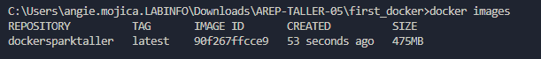

# Taller 5: Modularización con virtualización e introducción a docker
El taller consiste en crear una aplicación web pequeña usando el micro-framework de [Spark java](http://sparkjava.com/). Una vez tengamos esta aplicación procederemos a construir un container para docker para la aplicación y los desplegaremos y configuraremos en nuestra máquina local. Luego, cerremos un repositorio en DockerHub y subiremos la imagen al repositorio.

La aplicación permite determinar:
* Sin
* Cos
* Si una cadena es un palíndromo
* Retorna la magnitud de un vector real de dos dimensiones, es decir recibe dos parámetros reales.

## Iniciando

Estas instrucciones le permitirán obtener una copia del proyecto en funcionamiento en su máquina local para fines de desarrollo y prueba.

### Prerequisitos

Qué cosas se necesitan para ejecutar el software.

* Git
* Maven
* Java
* Docker

### Procendimiento para habilitar imagen a Dockerhub

#### Local

* Se crea una imagen de docker a partir del Dockerfile

    ```bash
    docker build --tag dockersparktaller .
    ```

* Se verifica que la imagen se haya creado correctamente

    ```bash
    docker images
    ```

    
* Se crea un contenedor a partir de la imagen creada

    ```bash
    docker run -d -p 34000:46000 --name dockercontainer dockersparktaller
    ```

    
    Con lo anterior, se permite utilizar la [aplicación](https:localhost:34000) en el puerto 34000.

#### Dockerhub

* Una vez creada la cuenta en [Dockerhub](https://hub.docker.com/) se crea un repositorio para luego en el motor de docker local crear una referencia a la imagen con el nombre del repositorio a donde desea subirla:

    ```bash
    docker tag dockersparktaller angiemojica/calculate_spark_web
    ```

* Se verifica que la imagen se haya creado correctamente

    ```bash
    docker images
    ```

    

* Se hace login en dockerhub

    ```bash
    docker login
    ```

* Se sube la imagen al repositorio

    ```bash
    docker push angiemojica/calculate_spark_web:latest
    ```

    En la pestaña de tags del repositorio se puede ver la imagen subida.

    

### Ejecución

Para ejecutar la aplicación en su máquina local, siga los siguientes pasos:

* Debe bajar la imagen de Dockerhub

    ```bash
    docker pull angiemojica/calculate_spark_web:latest
    ```

    Podrá ver que la imagen se descargó correctamente en la aplicación de docker en la pestaña de images.:

    

* Se crea un contenedor a partir de la imagen descargada

    ```bash
    docker run -d -p 34000:46000 --name dockercontainer angiemojica/calculate_spark_web
    ```
    Podrá ver que el contenedor se creó correctamente en la aplicación de docker en la pestaña de containers.:
    
* Con lo anterior, se permite utilizar la [aplicación](https:localhost:34000) en el puerto 34000.

    

## Diseño de la aplicación

Se ha creado la clase `SparkWebServer` que se encarga de manejar las peticiones GET y calcular los valores de las funciones matemáticas y de las cadenas.

## Documentación

Para generar la documentación de la aplicación, debe ejecute el siguiente comando.

```bash
mvn javadoc:javadoc
```
El anterior comando crea un archivo con la documentación de la aplicación, esta la puede encontrar en `./target/site/apidocs/index.html`.

## Autor

* **Angie Natalia Mojica** [Angie Natalia Mojica](https://www.linkedin.com/in/angienataliamojica/)

## Agradecimientos

* Al profesor [Luis Daniel Benavides Navarro](https://www.linkedin.com/in/danielbenavides/) por la guía y la enseñanza en el curso de Arquitecturas Empresariales.