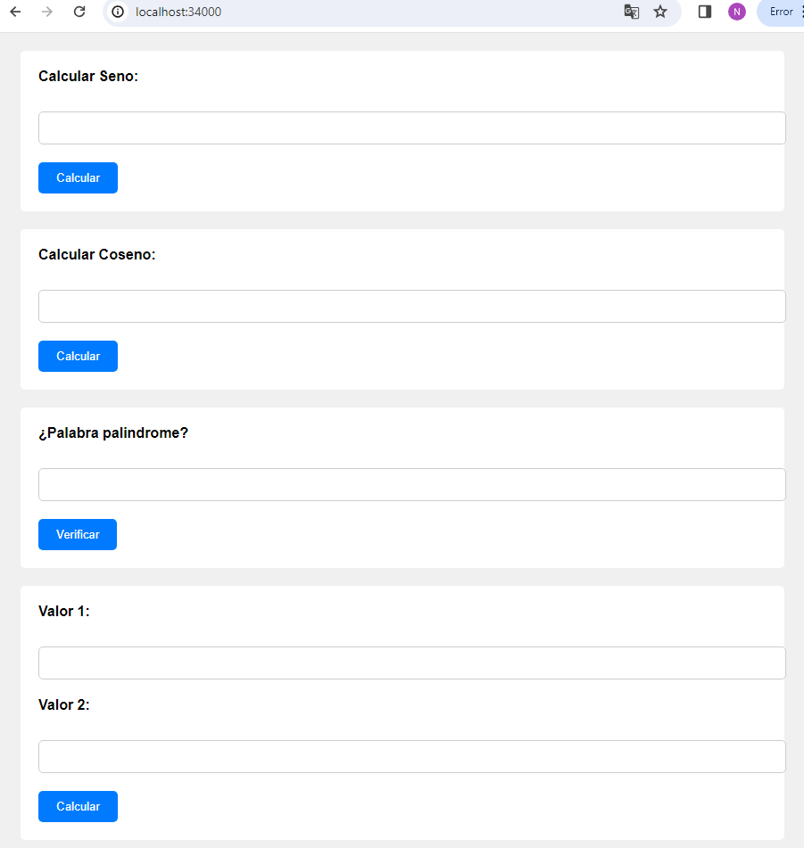

# AREP-TALLER-05
Modularización con virtualización e introducción a docker

Commands to run the project
```bash
docker build --tag dockersparktaller .
```


```bash
docker run -d -p 34000:46000 --name dockercontainer dockersparktaller
```


```bash
docker tag dockersparktaller angiemojica/calculate_spark_web
```


```bash
docker login
```

```bash
docker push angiemojica/calculate_spark_web:latest
```





```bash
docker pull angiemojica/calculate_spark_web:latest
```


```bash
docker run -d -p 34000:46000 --name dockercontainer angiemojica/calculate_spark_web
```


